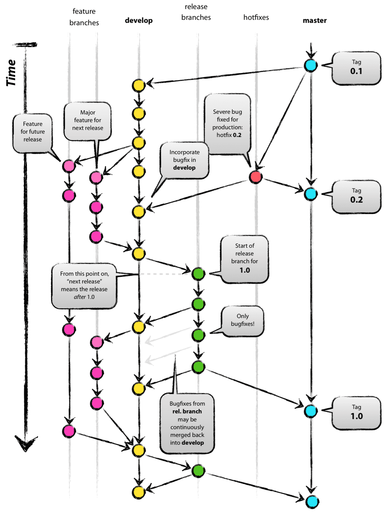
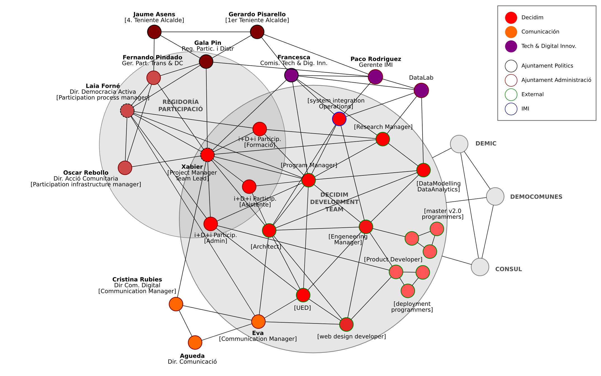

# 2 Plan de Desarrollo

## 2.1	Objetivos

El diseño, desarrollo y administración de la plataforma Decidim Barcelona es una de las prioridades de la *Direcció de Recerca, Desenvolupament i Innovació en Participació, Transparencia i Drets de Ciutadania*, con el objetivo de convertirla en una red política o web 3.0 con una infraestructura distribuida y una capacidad de articulación de la inteligencia colectiva y la participación democrática transparente, segura y colaborativa. Su objetivo a largo plazo de hacer frente al dominio de las grandes corporaciones sobre las redes sociales y sustituir el extractivismo de la colaboración social por infraestructuras digitales abiertas, comunes y democráticas.

Los **objetivos** de la plataforma incluyen:

* Articular, visualizar y comunicar todos los procesos y espacios de participación impulsados por el Ajuntament de Barcelona

* Permitir y garantizar una participación inclusiva, accesible, segura y que defienda la privacidad de las personas usuarias.

* Estandarizar los procesos de participación, su estructura, difusión, análisis, evaluación,  las formas de transparencia asociadas a estos así como el establecimiento de indicadores de calidad democrática asociados a ellos.

* Facilitar el desarrollo y auto-organización de procesos y mecanismos de participación por parte de la ciudadanía.

* Ofrecer herramientas para la participación comunitaria, la comunicación política y la coordinación colaborativa de la ciudadanía y entidades sociales.

Los objetivos de este plan de desarrollo son:

* Permitir una planificación operativa para el desarrollo de la plataforma: identificación de necesidades de desarrollo, recursos, personal, calendarios, etc.

* Fijar las funcionalidades y sus fechas de implementación en función de las necesidades previstas por la Regidoria de Participació del Ajuntament

* Facilitar la colaboración con otros agentes con los que es preciso coordinar el desarrollo

* Prototipar modelos de desarrollo de software libre en el propio Ajuntament de Barcelona, que sean colaborativamente abiertos, con protocolos interoperables, soberanos (gestionables por las propias entidades que dan los servicios, en este caso el Ajuntament) y respetuosos con la privacidad y la transparencia.

* Servir de documento base para el desarrollo participativo del propio Decidim Barcelona y para la construcción de una comunidad alrededor del proyecto.

* Establecer, prototipar y sistematizar metodologías ágiles de desarrollo abierto, colaborativo y participativo para el desarrollo de la plataforma.

## 2.2	Aspectos y organización del desarrollo

Desde el punto de vista de vista del desarrollo de decidim.barcelona, como proyecto socio-tecnico, se han de atender a los siguientes **aspectos**:

* **Gobernanza**: Por ahora limitada a la Direcció de Recerca, Desenvolupament i Innovació de Drets de Ciutadania, Participació i Transparència, el Comisionado de Participació i la Regidoria de Participació i Territori, la gobernanza de la plataforma exige abrir el proceso de decisión y diseño de funcionalidades a la ciudadanía y una gestión distribuida y comunitaria de los repositorios. Para ello es preciso buscar formas jurídicas, dinámicas comunitarias y herramientas específicas que permitan un gobernanza procomún del desarrollo y de su implementación.

* **Diseño tecnopolítico**: Nos referimos al diseño general de funcionalidades de la plataforma, así como a la toma de decisiones sobre las tecnologías que se utilizan, que han de conectar (o moverse más acá de la distinción entre) consideraciones técnicas y políticas. Esto incluye la investigación de los sistemas de seguridad, cifrado, anonimato, los modelos de desarrollo (modularidad, escalabilidad, interoperabilidad, APIs, estandares, etc.), así como sus interfaces (backend: API’s, datos abiertos; y frontend: apps, usabilidad, accesibilidad). Esta labor requiere integrar aspectos de coordinación con las funcionalidades y particularidades de los procesos de participación del Ajuntament,  así como la proyección y exploración de posibilidades que ofrecen la plataforma, el contexto tecnológico y político, y su implantación en la ciudad (datos abiertos, aplicaciones móviles, brecha digital, interfaces de proximidad de los equipamientos públicos, etc.).

* Contratación y **gestión del desarrollo del software**: incluye el diseño de pliegos de contratación, el acompañamiento de la comunidad de desarrolladoras de la plataforma, así como el ensamblado de las diferentes piezas que la componen, que van de aquellas que tienen que coordinarse con la dirección de comunicación del Ajuntament a aquellas que tienen que ver con la infraestructura de cifrado, pasando por los diferentes módulos funcionales de la plataforma.

* **Administración** y gestión: incluye la gestión digital de los procesos concretos de participación que se realicen a través de la plataforma (eso incluye la configuración de los módulos, alta de usuarios, gestión de fallos o* bugs*, activación de funcionalidades, gestión de alertas, etc.), así como las tareas más generales de administración de toda la plataforma: activar y desactivar procesos, configurar la página principal, administrar a los editores y facilitadores de los procesos, coordinarse con el resto de técnicos del Ajuntament y del equipo de gobierno, etc.

* **Investigación y evaluación**: sólo un liderazgo fuerte en la investigación de las dinámicas de la plataforma puede permitir ordenar y planificar su desarrollo para mejorar la calidad democrática, su impacto y usabilidad. Como todo proceso de desarrollo de software de tipo social, Decidim Barcelona necesita insertar en su ciclo de desarrollo un proceso empírico de evaluación y formulación de mejoras basado en metodología cuantitativas y cualitativas de análisis y el desarrollo de modelos matemático-computacionales de prototipado.

* **Capacitación** en el uso de la plataforma: aquí entran los cursos y labores de formación, orientación y facilitación tanto para el equipo de gobierno como para el personal técnico, pero también para la ciudadanía y los diversos agentes sociales. En este caso, es fundamental dar a esa capacitación una aproximación tecnopolítica crítica, orientada a la construcción de una administración y una ciudadanía activa. 

* **Aspectos legales**: Las funcionalidades que ofrece Decidim Barcelona vehiculan elementos especialmente sensibles ya que incorporan aspectos nucleares del sistema democrático como son la toma de decisiones participativa, la transparencia, la rendición de cuentas, la articulación del tejido asociativo, la libertad de expresión, etc. A diferencia de las plataformas digitales privadas orientadas a extraer beneficios del tratamiento de datos de sus usuarios, la administración pública debe proteger con especial sensibilidad la privacidad de la ciudadanía ofreciendo garantías éticas, tecnológicas y políticas. Pero las plataformas digitales públicas, si han de sobrevivir en un contexto altamente competitivo, tampoco pueden renunciar a aquellas formas de tratamientos de datos que permitan mejorar la usabilidad y permiten estudiar y mejorar la calidad democrática de los procesos digitales al tiempo que garantizan una transparencia y trazabilidad a la que las iniciativas privadas no están orientadas. El reto al que se enfrenta por tanto Decidim Barcelona es el de equilibrar derechos y libertades en tensión (privacidad y transparencia) al tiempo que no obstaculiza el estudio de las interacciones digitales que permiten mejorar la plataforma y la calidad democrática de los procesos que allí se desarrollan.

* **Coordinación** del desarrollo de la plataforma con otros ayuntamientos e instituciones: Barcelona se posiciona como líder en la participación tecnológicamente mediada a través de la plataforma Decidim Barcelona. En estos momentos, tanto la Localret (consorcio de administraciones locales catalanas) como la Diputación de Barcelona han mostrado un interés y compromiso por utilizar la plataforma decidim.

## 2.3	Flujo de desarrollo

El flujo de desarrollo se refiere a la forma en la que se articulará en el tiempo las diferentes versiones, funcionalidades y procesos de desarrollo, algunas veces de manera secuencial, otras de manera paralela, para permitir satisfacer todas las necesidades de despliegue de funcionalidades y de coordinación del desarrollo de la plataforma.

Adelantamos cómo serán planeadas las ramificaciones del desarrollo de decidim a nivel lógico y sus diferentes versiones e instancias, en un modelo basado en el flujo propuesto inicialmente por el proyecto de software libre git flow[^4], diferenciando las siguientes ramas tal y como se ven en la imagen: 

* **master**: es la versión estable, la que tomarán otras entidades que vayan a usar el software

* **develop**: es la versión en desarrollo sobre la que se integran las demás ramas. 

* **release**: va acumulando los desarrollos y las features para la siguiente versión estable, publicándose a través de releases de GitHub. 

* **hotfixes**: sólo para corregir fallos rápidamente.

* **feature-X**: donde X son diferentes funcionalidades que pueden o no llegar para un hito o milestone concreto del master. Los nuevos componentes u otras posibles funcionalidades se desarrollan en estas ramas paralelas hasta que estén completadas.

Debido al desarrollo extremo en el que hay que satisfacer rápidamente funcionalidades o mejoras durante los propios procesos de participación se podría crear otro repositorio sobre el que se realizará el trabajo a diario por parte del equipo de desarrollo de decidim, **Decidim Barcelona**, donde se encuentran los archivos de configuración específicos de Barcelona así como el código que se sube directamente a los servidores para el uso final por parte de la ciudadanía. Esta versión parte desde la rama de release del repositorio padre de decidim y trabaja sobre la rama develop. Mensualmente a través de un procedimiento predefinido y automatizado el código es limpiado de referencias a Barcelona y subido al repositorio padre de decidim.

Las ciudades piloto pueden mantener su propio repositorio si lo desean, por ejemplo para el caso del Ajuntament d’Hospitalet del Llobregat se trataría de **decidim hospitalet**, pero la aplicación en ningún caso de requerir un fork o una rama para su despliegue o uso por parte de otra entidad, si alguien instala la versión master de decidim debería de poder configurar en su servidor la aplicación y hacerla funcionar sin tener que tocar el código de ningún modo. La función y justificación de una rama **Decidim Barcelona** sería la de operar como línea de desarrollo adaptada a las necesidades específicas del Ajuntament y la ciudad en su conjunto, puede que esta rama incluya funcionalidades avanzadas que aún no están disponibles en el repositorio oficial, o modificaciones especiales derivadas de alguna integración específica de decidim con otras tecnologías del Ajuntament de Barcelona o por motivos de compatibilidad hacia atrás con otros procesos de participación que se diseñaron con anterioridad a la rama estable decidim. 

Dado que el código no está ahora mismo bien construido para un desarrollo sostenible y modular (véase informe "Propuesta de cambios en la Arquitectura de Consul"[^1]) se planea realizar un repositorio de decidim que se irá desarrollando en paralelo y que eventualmente vendrá a sustituir al repositorio actual. Una vez este nuevo aplicativo esté funcional, Decidim Barcelona estará basado en esta nueva versión.

Figura 1: "A successful Git branching model" por Vincent Driessen publicado el 5 de enero de 2010 [http://nvie.com/posts/a-successful-git-branching-model/](http://nvie.com/posts/a-successful-git-branching-model/) 

## 2.4	Arquitectura del desarrollo

La arquitectura de desarrollo es relativamente compleja dada la naturaleza del proyecto que obliga, por decirlo de algún modo, a construir el barco según navega.

### 2.4.1	Estrategia de sostenibilidad, usabilidad y escalabilidad

De cara a resolver los problemas encontrados para el crecimiento de Consul se va a trabajar en una nueva versión del decidim. Esta versión parte de un informe (véase "Propuesta de cambios en la Arquitectura de Consul"[^1]) dónde se ha realizado un estudio pormenorizado de los principales inconvenientes encontrados en la arquitectura actual así como realizar una propuesta de cambios que hay que realizar para acercarse a un modelo que permita actualizar de manera sencilla el código entre el proyecto padre y sus derivados, compartir distintos procesos que se hayan realizado al estilo de plugins, módulos o addons y permitir realizar cambios en la interfaz (diseño web, cambios de texto, etc). 

El modelo propuesto sobre el que se trabajará a partir de la nueva versión de decidim es el de una aplicación  web Ruby on Rails con un desarrollo modular basado en Engines, donde existan componentes diferenciados para las distintas posibilidades (Propuestas, Debates, Legislación colaborativa, Citas presenciales, etc), así como mejoras en la documentación, tanto para su instalación como para su reutilización y adaptación por parte de otras entidades. 

### 2.4.2	Glosario / Ontología del decidim

A continuación detallamos la definición de la terminología propia utilizada a lo largo del documento. 

**Proceso participativo**: serie de momentos o actividades que involucran a diversos agentes (principalmente, la ciudadanía, organizada o no), los cuales comparten perspectivas y diálogos, a menudo orientados a tomar decisiones en común. En la estructura de decidim, esos momentos o actividades se corresponden con diferentes componentes: Propuestas, Debates, Citas, Encuestas, Legislación colaborativa, etc.. Todos estos componentes poseen una serie de fases (Anuncio, Presentación, Deliberación, Aportaciones, Conclusiones, etc.) y cada fase cuenta con un inicio y un fin delimitados en el tiempo. Para evitar equívocos, puesto que existe un componente de Debates no se debe utilizar el término "debate" en referencia al  espacio de comentarios de una propuesta. Con respecto a las propuestas, dependiendo del caso, éstas pueden recibir tanto apoyos como votos. Ambos son conceptos diferenciados ya que (1) los apoyos son por definición positivos, y se realizan a las propuestas, y (2) los votos pueden ser positivos o negativos, y se aplican habitualmente a los comentarios.

**Espacios de participación:** forma o canal de participación permanente. A diferencia de los procesos, no tiene un inicio ni un fin definidos. Entre ellos destacan los **órganos de participación**: Los órganos de participación hacen referencia a los grupos de personas y/o agentes sociales que se reunen periódicamente y que tiene cierto grado de influencia oficial sobre el gobierno municipal en áreas o territorios específicos. Son principalmente los consells: de ciutat, de distrito, sectoriales y de barrio. Tienen una función de consulta, asesoría y propuesta para incidir en determinadas políticas públicas municipales [^2].  Puede ser una categoría propia o incluidos dentro de los espacios de participación a modo de subcategoría. También puede considerarse un espacio de participación la sección de **iniciativas populares **orientada a facilitar la suma de apoyos o firmas para que iniciativas ciudadanas asciendan al pleno o logren alcanzar la masa crítica necesaria para convocar un referéndum o consulta (el mecanismo específico para llegar a este punto depende del Nuevo Reglamento Municipal de Participación).

**Herramientas**: Aplicaciones y servicios externos al decidim que aportan funcionalidades complementarias al conjunto del proyecto decidim.

**Componentes**: conjunto de funcionalidades operativas en un Proceso o Espacio. Ejemplos de componente son las citas presenciales, las propuestas, los debates, las encuestas, los comentarios o el sistema de apoyos.

**Agentes**: son los sujetos (usuarios) de la plataforma, que pueden pertenecer a 5 categorías: ciudadanía, Ajuntament, entidades (asociaciones, ONG, etc.), citas presenciales (se entienden como sujetos colectivos temporales), y grupos (ver debajo)

**Grupos:** los grupos son un tipo de agente especial, están a su vez compuestos de otros agentes (ciudadanas, entidades y/o Ajuntament), pueden tener permisos o roles especiales en la plataforma. Un ejemplo repetido será el del "grupo promotor", que puede que tenga citas presenciales asignadas, así como posibilidades de decidir o intervenir de manera especial en algunos espacios. 

### 2.4.3	Funcionalidades

El plan de desarrollo actual de la plataforma Decidim Barcelona incluye los siguientes hitos o funcionalidades posibles, especificados a corto plazo (año 2016), medio plazo (año 2017) y largo plazo (año 2018):

1. Corto plazo (2016):

  1. **Inicio del PAM**: Planificación, desarrollo y ejecución del proceso participativo..

    2. **Debates con Concejales**: mejoras en la organización y disposición de las preguntas ciudadanas.

    3. **Respuestas y Actuaciones**: diseño y aplicación de las respuestas de las Propuestas del PAM, así como de las Actuaciones sobre las que se recoge la versión del PAM actualizada. 

    4. **Retorno del PAM**: Finalización del proceso participativo del PAM y retorno a los y las participantes: visualización de datos, mailing, descarga del PAM en formato PDF, trazabilidad, etc.

    5. **Dataviz**: Integración y estandarización del módulo de apertura y visualización de datos para todo el decidim.

    6. **Configurador de Procesos Participativos**:** **Desarrollo de la meta-funcionalidad que permite configurar y administrar procesos participativos con sus correspondientes componentes (funcionalidades).  Ver Anexo "Especificaciones para el Configurador de Procesos Participativos". 

    7. **Rediseño imagen gráfica: **Nuevo estilo con hincapié en la usabilidad y accesibilidad, atendiendo a la doble configuración de los procesos popr fases y por componentes.

    8. **MetaDecidim**: Desarrollo del espacio participativo para mejorar, definir y decidir el desarrollo futuro de la plataforma. 

2. **Medio plazo**:** (2017)**

    9. **Modularización**: Desarrollo del código a través de componentes independientes. Esto facilita, por un lado, que el desarrollo sea modular, a través de módulos funcionales independientes del núcleo, y por otro, que sea escalable con un incremento de funcionalidades y/o instalaciones, y un crecimiento en el número de usuarios registrados. De esta manera se facilita las configuración y administración adaptada a cualquier institución o grupo que decida instalar y utilizar la plataforma.

    10. **Multitenancy: **Múltiples instancias de la plataforma en una sola instalación. Posibilidad de ofrecer *Decidim as a Service* (DaaS), para que se puedan servir instancias a municipios y/o organizaciones que no puedan asumir el coste y mantenimiento de una infraestructura propia.

    11. **Multilingüe**: Desarrollo de un módulo de traducción automática o manual multilingüe.

    12. **Seguimiento PAM**: Desglose de actuaciones en proyectos, integración con sistema de seguimiento de gerencia, integración con transparencia presupuestaria, implementación de indicadores de seguimiento.

    13. **Presupuestos Participativos**: Desarrollo del proceso de presupuestos participativos en el que se asigna un porcentaje sobre el total de los presupuestos de inversión y en el cual la ciudadanía puede hacer propuestas de proyectos, que serán valoradas por técnicos municipales y luego priorizadas por la ciudadanía.

    14. **Proceso de las Normas Reguladoras de la participación:** Elaboración de un primer piloto de proceso de legislación colaborativa.

    15. **Encuestas**: Desarrollo de un componente basado en cuestionarios para obtener feedback a partir de una serie de preguntas de distinto tipo (multiples opciones, texto simple, valores numéricos, etc.) en distintas escalas (toda la ciudad, uno o más distritos, uno o más barrios, etc.). 

    16. **Propuestas geolocalizadas: **geolocalización de propuestas para procesos de participación urbanísticos como *Superilles*.

    17. **Iniciativas ciudadanas: **Espacio de participación permanente para realizar propuestas que puedan ser llevadas al pleno municipal con un determinado número de apoyo.

    18. **Consultas: **Votaciones sobre una pregunta, actuación o política determinada (plan, proyecto, programa, etc). 

    19. **Consells de barri**: Desarrollo de un espacio dedicado a los Consells de barri donde documentar, mapear y seguir toda su actividad, e introducir algunos mecanismos de interacción entre usuarios y usuarias de la plataforma y los Consells de barri.

    20. **Agenda ciudadana:** Integración de un calendario colaborativo de  actividades sociales y culturales de Barcelona publicadas por ciudadanas para incrementar el interés en la plataforma como un canal de información municipal.

    21. **Streaming**: Integración de una infraestructura que facilite la emisión de vídeo en streaming para las citas presenciales.

    22. **Gamificación: **Definición de un plan de gamificación de la plataforma.

    23. **Perfil de usuaria y organización enriquezido**: Desarrollo de una página de usuario enriquecida, para los individiduos y organizaciones de la plataforma.

    24. **Colaboración interna**: Diseño, desarrollo e integración de un módulo para la colaboración y coordinación entre editores/facilitadores de procesos de participación.

    25. **Microblogging**: Diseño e integración de funcionalidades de red social. 

    26. **Colaboración social**: Diseño e integración de herramientas de colaboración social (escritura colaborativa, calendarios, compartición de contenidos digitales, crowdsourcing, etc.)

    27. **Espacio comunitario**: Diseño y desarrollo de un espacio para integrar las necesidades de comunicación y coordinación de la acción comunitaria (casales de barrio, equipamientos de proximidad) en materia de calendarios, autogestión y co-gestión de proyectos comunitarios, por ejemplo.

    28. **Deliberación y controversias**: Diseño de funcionalidades orientadas a la deliberación ampliada en la plataforma (posibilidad de incluir foros, interfaces estilo Better Reykjavik, etc.), así como para conectar con procesos de conflicto social. Las interfaces deberán enriquecerse con métodos de análisis de discusiones para facilitar la identificación y visualización de contenidos de interés y controversias para facilitar el acceso a la información y fomentar el espíritu crítico en espacios de deliberación.

    29. **Debates presenciales**: Diseño de funcionalidades que faciliten la colaboración, la transparencia y la participación multitudinaria en procesos presenciales de deliberación ciudadana tales como "conferencias ciudadanas", “jurados ciudadanos”, “urnas y encuestas deliberativas”, etc, sobre asuntos transversales como el modelo de ciudad smart city vs ciudad democrática).

    30. **Detección de contenidos similares**: Diseño de funcionalidades de filtrado colaborativo de contenidos que faciliten la detección de contenidos similares generados por usuarios (p.ej.: propuestas idénticas para proponer su fusión, recomendación de contenidos a usuarias, etc.).

    31. **Auto-convocatoria [función de componente citas]**: Diseño de funcionalidades que potencien la autoorganización social (p.ej.: componentes de autoconvocatoria de eventos participativos, con potencial mediación del Ajuntament de Barcelona).

    32. **Indicadores calidad-democrática**: Introducir funcionalidades que indiquen estándares de calidad (rankings comparativos, posible comunidad evaluadora distribuida, mecanismos ágiles de evaluación ciudadana de la calidad de procesos, etc.) [posible aplicación para filtrado colaborativo de componentes]

    33. **App**: Desarrollo de aplicación móvil para sistemas operativos como Android e iOS.

3. **Largo plazo (2018): **

    34. **Integración de identidad digital distribuida: **Integración de 

    35. **Desarrollo identificación interoperable** entre plataformas "decidim" (p.e.: verificación de identidad local compatible con las instancias de la futura red de decidim municipales).

    36. **Integración con otras plataformas digitales: **sistemas ya existentes de datos del Ajuntament  de Barcelona y de la ciudad (p.ej.: el proyecto de sistema integración y gestión de los "grandes datos" de la ciudad, CityOS, Sentilo, la Bústia ciutadana, IRIS, etc.), a fin de potenciar la detección de problemas, diagnosis de un proceso, la recogida de propuestas y la  toma de decisiones informadas incluidas procesos ampliados de deliberación, incluyendo opciones de debate en tiempo real (p.ej.: en caso de problemas públicos como la contaminación).

*2.4.4	Revisiones periódicas *(2016-2018)

Con el fin de garantizar la calidad de la plataforma, la comunidad del decidim establecerá prioritarias las siguientes revisiones periódicas

    37. **Revisión Stallman**: Substitución de servicios externos no libres (Google Analytics, Google Maps, Heroku, etc.) y substitución por libres.

    38. **Revisión Snowden**: establecer unas garantías de privacidad y anonimato (parte técnica), y una pedagogía en el inicio de sesión con el fin etc. 

    39. **Revisión Mitnick**: auditoría empleando técnicas de ingeniería social en materia democrática  para explorar las vulnerabilidades de la plataforma a posibles intrusiones de actores que pretendan desvirtuarla. 

    40. **Revisión LulzSec**: Auditoría de seguridad frente a ataques típicos en el contexto del desarrollo web: Inyecciones SQL, autenticación y sesiones, Cross-Site Scripting (XSS), Cross-Site Request Forgery (CSRF), a través de pruebas de penetración de caja blanca o negra. 

### 2.4.4	Fases

El desarrollo se plantea en distintas fases. Estas fases conectan con releases a lo largo de los siguientes dos años, que engloban varias funcionalidades en coordinación con otras entidades e instituciones que han mostrado interés por la experiencia del Decidim Barcelona. 

Como se comenta anteriormente, se está en conversaciones con Localret y Diputación de Barcelona, que a su vez están en tratativas con municipios de distintas escalas. Se adjunta las versiones con las que se contará en los siguientes meses, con que contará cada una de estas versiones y en qué municipios funcionaria. 

<table>
  <tr>
    <td>N</td>
    <td>Release</td>
    <td>Explicación</td>
    <td>Fecha prevista</td>
    <td>Municipio/s</td>
  </tr>
  <tr>
    <td>v0.5</td>
    <td>CP: Configurador de Procesos</td>
    <td>Incluye Presupuestos Participativos, Normes de regulació de la participació, Teatre Arnau</td>
    <td>Octubre 2016</td>
    <td>Barcelona</td>
  </tr>
  <tr>
    <td>v1</td>
    <td>MM: Multitenancy + Modularización</td>
    <td>Reescritura liderada por Ajuntament de Barcelona, ya pensada para otros ayuntamientos</td>
    <td>Enero 2017</td>
    <td>Barcelona</td>
  </tr>
  <tr>
    <td>v1.5</td>
    <td>MM+CP</td>
    <td>Pilotos con otras ciudades</td>
    <td>Marzo 2017</td>
    <td>Otras Ciudades</td>
  </tr>
</table>

## 2.5	Roles y gestión de usuarias 

En la medida que el proyecto de Decidim Barcelona debe dar cabida a decenas de procesos de participación, cada uno con su grupo promotor, con múltiples tareas de administración y gestión del proceso, tanto los roles como los flujos de asignación de estos son  elementos fundamentales que deben estar descritos en detalle para garantizar el correcto funcionamiento de un determinado proceso.

Existen dos modelos para la gestión de los roles que corresponden a la versión 0.5 del decidim y a la versión 1.0.

Para la versión 0.5 se han identificado los siguientes roles asociados a un proceso de participación:

<table>
  <tr>
    <td>Categoría</td>
    <td>Rol</td>
    <td>Función</td>
  </tr>
  <tr>
    <td>Observadoras</td>
    <td>Usuaria anònima</td>
    <td>Puede ver todo el contenido público del decidim</td>
  </tr>
  <tr>
    <td>Participantes</td>
    <td>Usuària registrada sin verificar</td>
    <td>Puede participar en algunas de las funciones</td>
  </tr>
  <tr>
    <td></td>
    <td>Usuària registrada verificada</td>
    <td>Puede participar en todos los espacios de participación que se habiliten.</td>
  </tr>
  <tr>
    <td>Promotores</td>
    <td>Facilitador (digital)</td>
    <td>Dinamiza los debates en la plataforma.</td>
  </tr>
  <tr>
    <td></td>
    <td>Dinamizador</td>
    <td>Puede editar las citas presenciales y subir la información relacionada con esta una vez ha pasado</td>
  </tr>
  <tr>
    <td></td>
    <td>Moderador</td>
    <td>Es el responsable de moderar los contenidos tanto de debates, de propuestas o otros espacios con los comentarios habilitados siguiendo la netiqueta de la plataforma.</td>
  </tr>
  <tr>
    <td></td>
    <td>Revisor</td>
    <td>Trabaja y procesa los contenidos de un proceso de participación que tienen su origen en propuestas, citas y debates</td>
  </tr>
  <tr>
    <td>Admin</td>
    <td>Admin de proceso</td>
    <td>Responsable de un determinado proceso. Hereda todos los permisos de los promotores y puede asignar roles para ese proceso y por lo tanto administra los roles de un proceso.</td>
  </tr>
  <tr>
    <td>SuperAdmin</td>
    <td>Super Admin</td>
    <td>Tiene todas las funciones anteriores y puede asignar roles de Admin de proceso.</td>
  </tr>
</table>

Respecto al flujo para la asignación de roles existe un SuperAdmin responsable de la gestión de todos los permisos. Los Admin de proceso, que son los responsables del proceso en el decidim y parte del grupo promotor del proceso, se comunican con el SuperAdmin para que se les asigne el rol de Admin de proceso. Esta función de superadmin debe estar centralizada a una persona concreta para que ésta ejerza de responsable de esta función y evitar así la dispersión en la gestión de los roles.

Para la v.1.0 los roles son completamente configurables, por lo que se pueden crear N roles y asignar tantas funciones como se considere necesario para ese rol, en una tabla de gestión de roles donde cada rol tiene funciones marcables (con un checkbox) igual que lo hacen gestores de contenidos como Drupal.

## 2.6 	Flujo de gestión de incidencias

Habria un único mail: [suport@decidim.barcelona](mailto:suport@decidim.barcelona) que se encuentra conectado a un proyecto de Redmine. 

El flujo de gestión de incidencias consiste en:

1. Enviar correo a [suport@decidim.barcelona](mailto:suport@decidim.barcelona) con la cuestión/duda/incidencia. 

2. Se crea automáticamente el ticket en el Redmine dentro del proyecto Suport.

3. Una persona o grupo se encarga de categorizar el ticket (Rol, Bug, etc) y asignar a la persona que se encargará de su resolución. 

4. Cuando se responda al ticket desde el Redmine el usuario recibirá estas actualizaciones. 

5. En caso de necesitarlo, un usuario podría responder a los mails de respuesta y se actualizarán en el propio Ticket. 

<table>
  <tr>
    <td>Tipo de petición</td>
    <td>Origen</td>
    <td>Canal</td>
    <td>Proxy</td>
    <td>Destino</td>
  </tr>
  <tr>
    <td>Gestión de Roles</td>
    <td>Admin de proceso</td>
    <td>Mail: suport@decidim.barcelona</td>
    <td>Redmine</td>
    <td>Responsable 
Roles Decidim</td>
  </tr>
  <tr>
    <td>Bug</td>
    <td>Admin de proceso</td>
    <td>Mail: suport@decidim.barcelona</td>
    <td>Redmine</td>
    <td>Equipo Programación</td>
  </tr>
  <tr>
    <td></td>
    <td>Técnicas Ayuntamiento</td>
    <td>Mail: suport@decidim.barcelona</td>
    <td>Redmine</td>
    <td>Equipo Programación</td>
  </tr>
  <tr>
    <td></td>
    <td>Usuaria/organización</td>
    <td>Mail: suport@decidim.barcelona</td>
    <td>Redmine</td>
    <td>Equipo Programación</td>
  </tr>
  <tr>
    <td>Seguimiento técnico de un proceso</td>
    <td>Admin de proceso</td>
    <td>Mail: suport@decidim.barcelona</td>
    <td>Redmine</td>
    <td>Equipo técnico</td>
  </tr>
  <tr>
    <td></td>
    <td>Técnicas Ayuntamiento</td>
    <td>Mail: suport@decidim.barcelona</td>
    <td>Redmine</td>
    <td>Equipo técnico</td>
  </tr>
  <tr>
    <td></td>
    <td>Usuaria/organización</td>
    <td>Mail: suport@decidim.barcelona</td>
    <td>Redmine</td>
    <td>Equipo técnico</td>
  </tr>
  <tr>
    <td>Propuestas de mejora</td>
    <td>Admin de proceso</td>
    <td>Mail: suport@decidim.barcelona</td>
    <td>Redmine</td>
    <td>MetaDecidim</td>
  </tr>
  <tr>
    <td></td>
    <td>Técnicas Ayuntamiento</td>
    <td>Mail: suport@decidim.barcelona</td>
    <td>Redmine</td>
    <td>MetaDecidim</td>
  </tr>
  <tr>
    <td></td>
    <td>Usuaria/organización</td>
    <td>Mail: suport@decidim.barcelona</td>
    <td>Redmine</td>
    <td>MetaDecidim</td>
  </tr>
  <tr>
    <td>Verificar organización</td>
    <td>Usuària</td>
    <td>Mail: suport@decidim.barcelona</td>
    <td>Redmine</td>
    <td>Responsable Asociaciones</td>
  </tr>
  <tr>
    <td>Problemas de registro</td>
    <td>Organización</td>
    <td>Mail: suport@decidim.barcelona</td>
    <td>Redmine</td>
    <td>Responsable 
Registro</td>
  </tr>
</table>

## 2.7	Organización del grupo de desarrollo

El reto del desarrollo de Decidim Barcelona es complejo, ya que no se trata de un producto de software al uso sino de una plataforma que debe satisfacer necesidades múltiples, heterogéneas y concurrentes, cuyo desarrollo implica tanto aspectos de programación de software como la definición de protocolos de participación o la articulación de estrategias de comunicación social. La definición y construcción de funcionalidades específicas, la investigación e innovación sociopolítica, el aseguramiento de la escalabilidad del código, la coordinación inter-municipal en el desarrollo y despliegue del mismo, unidos a la competición con empresas privadas que están apostando fuerte en este ámbito, son tareas que han de integrarse en el propio proceso de desarrollo. En este sentido, el modelo de desarrollo tiene un carácter poliédrico y marcadamente tecnopolítico, que conecta diversas capas (y conflictos) de tecnología y política. 

Todo ello debe reflejarse en la organización del propio equipo de desarrollo. Una primera consecuencia de esta reflexión es la idea de que la organización del equipo ha de tener la forma de una red descentralizada, compuesta por numerosos actores pertenecientes a diferentes instituciones. Una segunda consecuencia es que la organización tendrá algunas características asociadas con el modelo organizativo de cuádruple hélice (que combina instituciones gubernamentales, sociales/ciudadanas, universitarias y empresariales Carayannis EG, Campbell 2009, 2010), con la precisión de que los tres primeros polos tienen una clara prioridad sobre el tercero. 

La estructura del equipo de desarrollo debe reflejar y articular operativamente esta complejidad en coordinación con otros departamentos, áreas y funciones del Ajuntament. Esto implica superar la estructura de relaciones típica de un proyecto de desarrollo de software desde el sector público. Este modelo de desarrollo de cuádruple hélice rompe con el modelo habitual, centrado en la coordinación público-privada de gobierno y empresas, basado en la externalización de la mayoría de aspectos de la concepción, desarrollo y despliegue del software e incluso los procesos asociados con el mismo. Por otro lado, frente a un modelo organizativo de desarrollo basado en cadenas de mando completamente verticales, canales de comunicación reducidos y conocimiento compartimentado, el modelo organizativo que se propone para el desarrollo del decidim se define por sus flexibilidad, facilitación de conexiones y comunicación, y compartición de conocimiento.

Conscientes de la relevancia del polo ciudadano y social a la hora de garantizar el éxito del desarrollo y despliegue de Decidim Barcelona, la Dirección promovera la emergencia de un ecosistema colaborativo de desarrollo y cuidado de la plataforma. Sin embargo, queda fuera del foco de este documento el reto de cómo estructurar y nutrir una comunidad de desarrollo colaborativo en torno a la propia plataforma. En su lugar, a continuación se tratan las relaciones de diseño, gestión y producción dentro del Ajuntament (incluyendo los servicios externalizados que deben incorporarse al desarrollo).

## 2.8	Estructura del grupo de desarrollo   

La organización de RRHH y funciones dentro del proyecto es compleja y debe comprenderse como una red de actores financiados, localizados y agrupados en entidades diversas, siendo el Ajuntament quien provee de los nodos de conexión central y asegura tanto la conectividad como la sostenibilidad de la red para el desempeño global de funciones.

  

       Figura X:  Red de actores ligados al desarrollo y despliegue de Decidim Barcelona  

La Figura X muestra la estructura aproximada de la red. El modelo organizativo está orientado a un tipo de desarrollo ágil[^3] y tecnopolítico, capaz de producir y conectar software, procesos, investigaciones y visiones políticas de modo dinámico, situado y reconfigurable.                                                                          

## 2.9	Software para la coordinación y  gestión de proyectos

Un plan de desarrollo tan ambicioso debe gestionarse a través de aplicaciones que permitan planificar proyectos, asignar y compartir recursos, realizar tareas, establecer comunicaciones fluidas, etc de modo fácil y seguro. Al mismo tiempo, en línea con la visión tecnopolítica del proyecto, dichas aplicaciones han de ser, preferiblemente, libres.  

Entre las principales aplicaciones que cumplen con estos tres criterios, pueden encontrarse Redmine, OrangeScrum, Agilefant, Taiga.io, Tuleap, KanBoard, Rocket.chat, Mattermost y MyCollab. También pueden encontrarse servicios privativos que cumplen funciones similares, tales como Basecamp, Trello, ZenHub, Waffle.io, etc. Pero las potenciales futuras dependencias de estos servicios y la fatal de soberanía sobre el software y sus funcionalidades descarta estas últimas soluciones.

Después de una breve experimentación y gracias a los medios provistos por el Departament Tecnic d’Internet, el equipo de desarrollo de decidim ha optado por las siguientes herramientas de coordinación:

* **Redmine** como gestor de proyectos, con los plugins agile y  [https://rdi.dtibcn.cat/redmine](https://rdi.dtibcn.cat/redmine) . Este gestor de proyectos permanecerá activo para varias tareas (gestión de incidencias, gestión de proyectos complementarios a Decidim Barcelona, etc.), pero se utilizará, de manera pública, el **gestor de proyectos propio de Github** para el desarrollo de código.

* El propio **Decidim Barcelona**, con los procesos de participación llamados MetaDecidim serán el medio oficial de facilitar a la ciudadanía, trabajadores del Ajuntament y otros agentes sociales el acceso a la planificación del desarrollo.

* **Rocket.chat** como espacio de coordinación y mensajería instantánea.

[^1]: Pereira de Lucena, A. y Blanco-Gracia, A. (2016) Propuesta de cambios en la Arquitectura de Consul. https://docs.google.com/document/d/1lbFiDLKspvoCeklW7dH7FbCfK8ZMj_7-sYsk3DfCT7o )
[^2]: http://governobert.bcn.cat/ca/participacio/espais-estables-de-participaci%C3%B3
[^3]: Una referencia relevante en este sentido es http://aaron.sanders.name/agile-team-members-roles-and-responsibilities
[^4]: Ver "A successful Git branching model" por Vincent Driessen publicado el 5 de enero de 2010 http://nvie.com/posts/a-successful-git-branching-model/